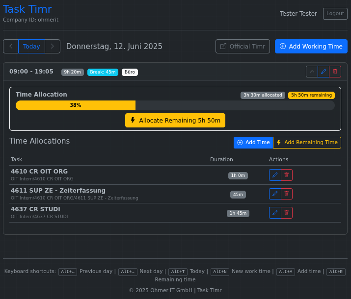

# Task Timr

Task duration-focused alternative frontend to Timr.com

A clean, elegant, and modern web interface for the Timr.com time tracking service that focuses on task duration rather than time slots.

## Disclaimer

This is an experiment which was created nearly entirely using automated LLM based coding agents and instructions in natural language ("Vibe Coding").

The main tools used where Replit Agent and Anthropic Claude Sonnet 3.7 / 4.

So this tool might contain strange or non-sensical code, and introduce security bugs - you have been warned!

## Overview

This application provides an alternative frontend for Timr.com that simplifies time tracking by focusing on:

1. Creating and editing work times for a day
2. Easily assigning time to tasks without complex time slot management
3. Showing available remaining time for allocation

## Features



- **Simple Working Time Management**: Create, edit, and delete working times with intuitive controls
- **Task-Focused Time Tracking**: Focus on how much time was spent on tasks, not when exactly
- **Remaining Time Visualization**: Clear visual indicator of allocated vs. remaining time
- **Recent Tasks**: Quick access to your 10 most recently used tasks
- **Keyboard Shortcuts**: Efficient navigation and common actions with keyboard shortcuts
- **Responsive Design**: Works well on both desktop and mobile devices

## Architecture

The application uses a layered architecture:

```
┌─────────────────┐     ┌──────────────────┐     ┌────────────┐
│   Frontend UI   │────▶│  Backend API     │────▶│ Timr.com   │
│   (Browser)     │◀────│  (Flask)         │◀────│ API        │
└─────────────────┘     └──────────────────┘     └────────────┘
```

### Key Components

1. **Frontend**: HTML, CSS, JavaScript
   - Uses Bootstrap for responsive design
   - Communicates with backend through REST API
   - No direct access to Timr.com API

2. **Backend API**: Python Flask application
   - Provides simplified REST API for the frontend
   - Handles authentication with Timr.com
   - Translates between UI model and Timr.com data model

3. **Data Models**:
   - `UIProjectTime`: Frontend-friendly representation of time allocations
   - Maps to multiple Timr.com project times in the backend

## Quick Start

For detailed installation instructions and development setup, see the [Developer Guide](doc/README.Developer%20Guide.md).

For comprehensive usage instructions and keyboard shortcuts, see the [User Guide](doc/README.User%20Guide.md).

## Deployment

Task Timr provides multiple deployment options:

### Docker (Recommended)

The fastest way to deploy Task Timr:

```bash
# Clone and setup
git clone <repository-url>
cd task-timr

# Development (secure localhost only)
./create_docker_container.sh

# Production (network accessible)
./create_docker_container.sh --global

# Script will prompt you to configure .env with your Timr.com credentials

# Verify deployment (uses .env configuration automatically)
./verify-deployment.sh
```

### systemd Service

For production Linux servers:

```bash
# Run the automated deployment script
chmod +x deploy-systemd.sh
./deploy-systemd.sh

# The script will prompt for configuration and handle the complete setup
```

### Development

For secure local development:

```bash
# Quick setup (localhost only - secure default)
./setup.sh
./start.sh

# Docker development (localhost only)
docker build -t task-timr .
docker run -p 127.0.0.1:5000:5000 --env-file .env task-timr
```

All deployment methods include:
- Health monitoring at `/health`
- Automatic service restarts
- Proper security configurations
- Performance optimizations

See the [Developer Guide](doc/README.Developer%20Guide.md) for detailed deployment instructions.

## License

This project is licensed under the MIT License - see the [LICENSE](LICENSE) file for details.

Copyright (c) 2025 Ohrner IT GmbH

## Documentation

- **[User Guide](doc/README.User%20Guide.md)** - Complete usage instructions and keyboard shortcuts
- **[Developer Guide](doc/README.Developer%20Guide.md)** - Installation, development setup, and architecture details  
- **[Testing Guide](doc/README.Testing%20Guide.md)** - Testing framework, naming conventions, and the Ten Laws for Unit Tests
