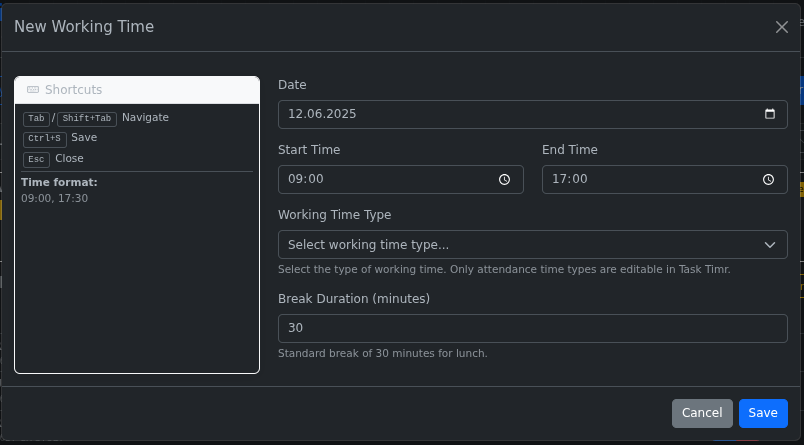
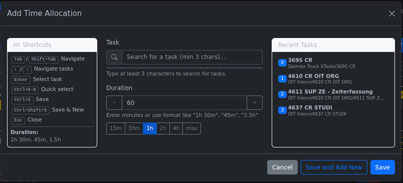

# Task Timr - User Guide

This guide will help you quickly get started with Task Timr, the task duration-focused alternative frontend to Timr.com.

## Core Concept

Task Timr simplifies time tracking by focusing on **task durations** rather than exact time slots. Instead of specifying when exactly you worked on each task, you simply:

1. Define your overall working time (start, end, breaks)
2. Allocate portions of that time to different tasks by specifying how long you worked on each

This approach is more natural and flexible, allowing you to track time based on what you accomplished rather than rigid time slots.

## Quick Start

1. Log in with your Timr.com credentials
2. Navigate between dates using the date navigation buttons
3. Create working times using the "Add Working Time" button
4. Click the chevron button to expand working time details
5. Add time allocations using the "Add Time" button
6. Distribute remaining time using the "Allocate Remaining" button

## Logging In

1. Enter your Timr.com username or email and password
2. The application automatically connects to your company (ID: ohrnerit)
3. Click the "Login" button
4. Upon successful login, you'll see the main interface showing today's working times

## Date Navigation

You can navigate between dates in three ways:

- Use the **Previous** (<) and **Next** (>) buttons to move one day at a time
- Click the **Today** button to jump to the current date
- Use keyboard shortcuts:
  - **Alt+Left Arrow**: Previous day
  - **Alt+Right Arrow**: Next day
  - **Alt+T**: Today

## Managing Working Times

### Adding a Working Time

1. Click the **Add Working Time** button (or press **Alt+N**)
2. Set the date, start time, end time, and break duration
3. Select a working time type from the dropdown (required)
4. Click **Save**

**Working Time Types**: You must select a working time type when creating working times. Common types include "mobiles Arbeiten" (mobile work), "Büro" (office), and other categories defined by your organization.

### Editing a Working Time

1. Click the **Edit** (pencil) icon on a working time
2. Modify the start time, end time, break duration, or working time type
3. Click **Save**

**Note**: Only working times with "attendance_time" category types can be edited. Some working time types may be read-only depending on your organization's configuration.

### Deleting a Working Time

1. Click the **Delete** (trash) icon on a working time
2. Confirm the deletion when prompted

## Time Allocations

### Viewing Time Allocations

1. Click the **Toggle Details** (chevron) icon on a working time
2. The time allocations section will expand, showing:
   - A progress bar indicating allocated vs. remaining time
   - A table of all current time allocations

### Adding a Time Allocation

1. Expand the working time details
2. Click **Add Time** button
3. Search for a task by typing at least 3 characters, or select from recent tasks
4. Set the duration in minutes (use quick buttons or type a custom value)
5. Click **Save**

### Using Remaining Time

If there's unallocated time in a working time:

1. Expand the working time details
2. Click **Allocate Remaining** button (appears when there's remaining time)
3. Select a task to allocate the remaining time to
4. The duration will automatically be set to the remaining time
5. Click **Save**

### Editing a Time Allocation

1. Expand the working time details
2. Click the **Edit** button next to a time allocation
3. Modify the duration as needed
4. Click **Save**

### Deleting a Time Allocation

1. Expand the working time details
2. Click the **Delete** button next to a time allocation
3. Confirm the deletion when prompted

## Task Selection

### Searching for Tasks

1. Type at least 3 characters in the task search field
2. Select a task from the dropdown results
3. Use arrow keys to navigate results and Enter to select

### Using Recent Tasks

1. View your 10 most recently used tasks under the "Recent Tasks" section
2. Click on a task to select it

## Keyboard Shortcuts

For efficient use, remember these helpful keyboard shortcuts:

- **Alt+Left Arrow**: Previous day
- **Alt+Right Arrow**: Next day
- **Alt+T**: Today
- **Alt+N**: New working time
- **Alt+A**: Add time allocation (to most recently expanded working time)
- **Alt+R**: Distribute remaining time (for most recently expanded working time)
- **Escape**: Close any open modal
- **Ctrl+S**: Save current form (works in modals)
- **Ctrl+Shift+S**: Save and add new (works in modals)
- **Ctrl+0-9**: Select recent task by number (in time allocation modal)
- **Arrow Up/Down**: Navigate through task search results
- **Enter**: Select a task from search results

## Interface Elements

### Working Time Display
Each working time entry shows:
- **Time Range**: Start and end times (e.g., "14:00 - 21:00")
- **Duration Badge**: Total working time (e.g., "6h 30m")
- **Break Badge**: Break duration (e.g., "Break: 30m")
- **Working Time Type**: Category badge (e.g., "mobiles Arbeiten", "Büro")
- **Action Buttons**: Toggle details (chevron), Edit (pencil), Delete (trash)

### Time Allocation Section
When expanded, working times show:
- **Progress Bar**: Visual representation of allocated vs. remaining time with percentage
- **Allocation Status**: Shows total allocated time and remaining time
- **Task Table**: Lists all time allocations with task names, durations, and actions
- **Quick Buttons**: "Add Time" and "Allocate Remaining" (when applicable)

### User Interface
- **Header**: Shows current user and logout option
- **Date Navigation**: Previous/Today/Next buttons with current date display
- **Official Timr Link**: Quick access to the original Timr.com interface

## Tips & Tricks

1. **Quick Duration Buttons**: Use the 15m, 30m, 1h, 2h, and 4h buttons to quickly set common durations
2. **Progress Bar Colors**: The progress bar visually indicates allocation status - yellow shows allocated time
3. **Task Breadcrumbs**: Full task hierarchy is displayed in the allocation table
4. **Smart Shortcuts**: Alt+A and Alt+R work on the most recently expanded working time
5. **Focus on Durations**: You only need to specify how long you worked on a task, not exact time slots
6. **Persistent State**: The interface remembers which working times you had expanded when you navigate between dates

## Troubleshooting

### Common Issues and Solutions

**Login Problems**
- Ensure you're using your correct Timr.com username/email and password
- Check that your company ID is correctly configured (should be "ohrnerit")
- If login fails, verify your credentials work on the official Timr.com website

**Data Loading Issues**
- If working times don't load, check the browser console for error messages
- Try refreshing the page if data appears outdated
- Ensure you're logged in - you'll see a login prompt if authentication expires

**Time Allocation Errors**
- Make sure you've selected a valid task before setting duration
- Verify the duration is a positive number
- Check that the total allocated time doesn't exceed the working time duration

**Interface Issues**
- If buttons don't respond, check if any modal dialogs are open and close them with Escape
- If keyboard shortcuts don't work, click in an empty area to ensure focus is not in an input field
- If time allocations don't display, try collapsing and re-expanding the working time details

**Browser Compatibility**
- This application works best in modern browsers (Chrome, Firefox, Safari, Edge)
- Ensure JavaScript is enabled
- Clear browser cache if you experience persistent issues

### Getting Help
If problems persist, check the browser's developer console (F12) for error messages that can help identify the issue.

## Data Synchronization

### How It Works
- All data is synchronized in real-time with your Timr.com account
- Changes made in Task Timr are immediately reflected in the official Timr.com interface
- Working times and project times created here follow the same validation rules as Timr.com
- You can switch between Task Timr and the official Timr interface seamlessly

### Data Consistency
- Task Timr consolidates multiple project time entries for the same task within a working time
- Duration-based allocations are converted to appropriate start/end times in the Timr.com system
- All time tracking data remains fully compatible with Timr.com reports and exports

### Official Timr Access
Use the "Official Timr" link in the interface header to quickly access the traditional Timr.com interface when needed.

---

Remember, this alternative frontend focuses on making time tracking simpler by allowing you to specify durations instead of exact time slots for each task.