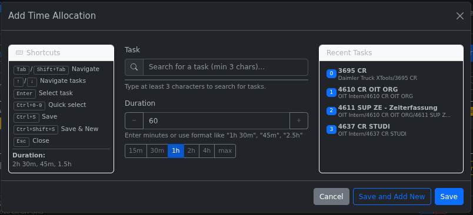
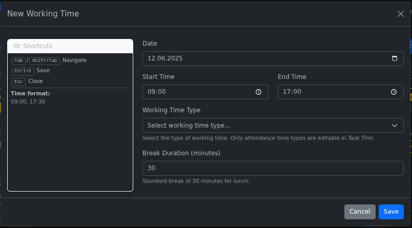

# Task Timr Documentation

This directory contains all documentation for Task Timr, the task duration-focused alternative frontend to Timr.com.

## Screenshots

The following screenshots showcase the main features of Task Timr:

### Main Interface

The main interface shows the task duration-focused approach with:
- Date navigation controls
- Working time entries with expandable time allocations
- Visual progress bars showing allocated vs. remaining time
- Quick access to add working times and time allocations

### Add Time Allocation Dialog

The time allocation dialog provides:
- Task search with minimum 3 characters
- Recent tasks for quick selection
- Duration input with quick-select buttons (15m, 30m, 1h, 2h, 4h, max)
- Keyboard shortcuts for efficient workflow

### New Working Time Dialog

The working time creation dialog includes:
- Date picker for flexible scheduling
- Start and end time inputs with time pickers
- Working time type selection (required)
- Break duration configuration
- Keyboard shortcuts panel for reference

## Documentation Files

### User Documentation
- **[User Guide](README.User%20Guide.md)** - Complete usage instructions, keyboard shortcuts, and troubleshooting guide for end users

### Developer Documentation
- **[Developer Guide](README.Developer%20Guide.md)** - Installation, development setup, architecture details, and coding patterns for contributors
- **[Testing Guide](README.Testing%20Guide.md)** - Testing framework, naming conventions, the Ten Laws for Unit Tests, and test execution instructions

## Key Features Illustrated

The screenshots demonstrate Task Timr's core philosophy:

1. **Duration-Focused Approach**: Instead of managing exact time slots, users specify how long they worked on each task
2. **Visual Time Management**: Progress bars clearly show allocated vs. remaining time
3. **Efficient Task Selection**: Recent tasks and search functionality streamline the allocation process
4. **Keyboard-Driven Workflow**: Comprehensive shortcuts for power users
5. **Clean, Modern Interface**: Responsive design that works on desktop and mobile

## Quick Links

- Return to [Main README](../README.md)
- View [User Guide](README.User%20Guide.md) for detailed usage instructions
- Check [Developer Guide](README.Developer%20Guide.md) for technical details
- See [Testing Guide](README.Testing%20Guide.md) for testing information